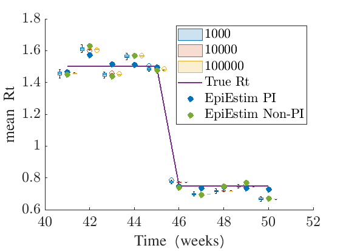

# UnderreportedAndTemporallyAggregated

This README file contains the currentw ork and outline for our project for inferring instantaneous reproduction number that accounts for temporally aggregated and under-reported incidence data.

## Overview

Our project is broken down into 3 main sections

1. Demonstrate that inference works for typical value of under-reporting (0.4) for a large number of epidemics (1,000).
2. Fixing the true incidence, and considering different reporting rates to generate the reported incidence. Investigate R inference and see how results vary for different values of under-reporting.
3. Finally using a real world data-set from an Ebola outbreak, investigate Rt inference for different values of under-reporting.

The message from each section should take roughly the following form:

1. Inference works for a wide range of epidemics, with higher accuracy and precision when incidence is higher

For sections 2 and 3, we expect there to be a nuance between two factors. In general, higher assumed true incidence will lead to higher levels of precision in reproduction number inference. But there may be some interaction between that and the value of under-reporting assumed.

## Section 1. Checking incidence is accurate.

We look at two case studies. Firstly, we look at a realistic outbreak. Secondly, we simulate a large number of epidemics, where the true Rt values are sampled from the gamma distribution that informs our prior.

