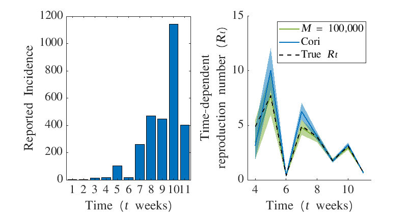
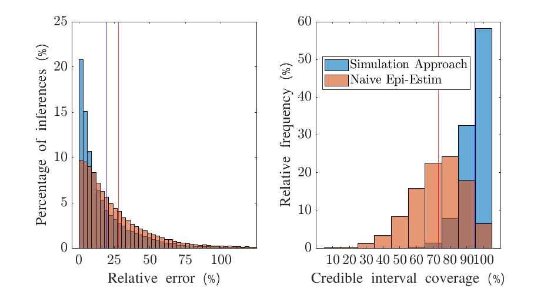
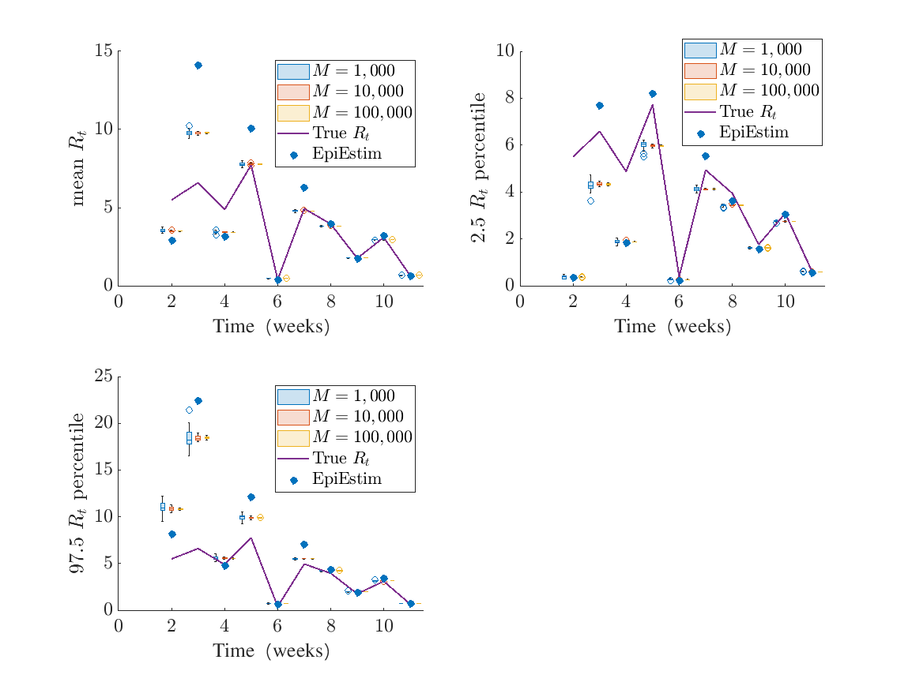
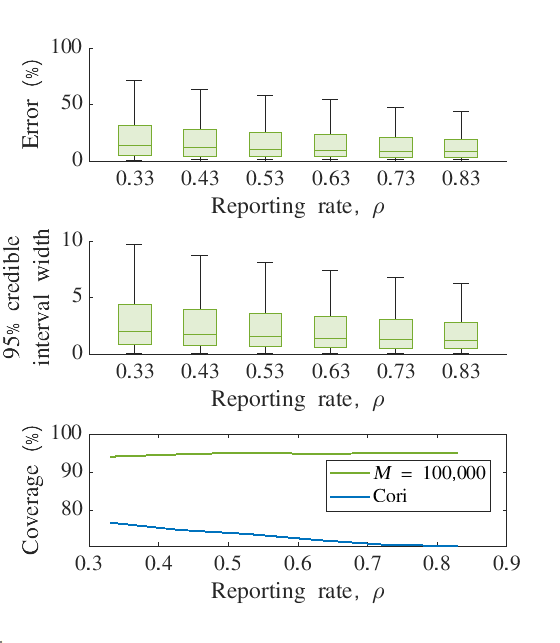
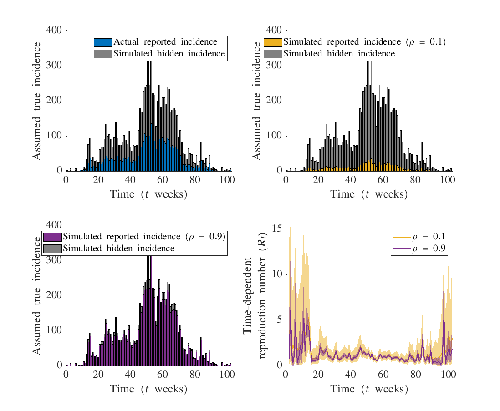

---
output:
  pdf_document: default
  html_document: default
---
# UnderreportedAndTemporallyAggregated

This README.md file contains the current work and outline for our project on inferring the instantaneous reproduction number whilst accounts for temporally aggregated and under-reported incidence data.

## Terminology

$\rho$: Under-reporting
$I_t$: True incidence at time $t$
$\hat{I}_t$: Reported incidence at time $t$
$M$: Sample threshold in ABC algorithm

## Overview

Our project is broken down into 3 main sections (with main message in brackets):

# 1. Simple single study and large study (fixing true incidence) to show inference works (lower errors than Naive EE, correct coverage, robust for $M=10^5$) 
# 2. Same large study  but stratified by $\rho$ (improving reporting leads to greater confidence in $R_t$ inference wrt credible intervals and mean error)
# 3. Real world data-set from an Ebola outbreak (in general, assuming higher $\rho$ leads to wider credible intervals)

Key concept: Coefficient of variation, $CV = \sigma/\mu$.

## Checklist

+ Generate temporally aggregated incidence with $R_t=1.5$ and re-infer $R_t$ for Ebola epidemic with 'stuttering start', that is to say an epidemic that starts with 1 case on day 1. Allow epidemic to grow until it exceeds 1000 cases, then switch to $R_t=0.75$ for final 5 weeks. Only show inference for final 10 weeks. DONE.
+ Repeat inference for this epidemic with different values of $M$ ($10^3, 10^4, 10^5$) and 30 different times for each $M$. Use this to assess the robustness/consistency of inference for each value of $M$. DONE.
+ Run 1,000 epidemics and for each one generate 6 possible reported incidences (with $\rho = 0.33, 0.43, 0.53, 0.63, 0.73, 0.83$). Infer with correct knowledge of reporting rate. $R_t$ is sampled from a Gamma(shape = 1, scale = 3) distribution, as this ensures incidence does not get too high or too low. We then use this distribution as our prior when performing the inference. DONE.
+  Using these 6,000 inferences we can look at the coverage and the error. We look at the coverage over all values of $\rho$ and look at the distribution of correct coverage over all simulations, as well as what the total coverage is. This total coverage should be close to 95% since we use 2.5 and 97.5 credible intervals. For the error, we look at the distribution and calculate the mean error. DONE
+ We may need to qualify the significance of this distribution and the mean error. I have tried to do this by repeating the inference again but using a Naive Epi-Estim approach. DONE
+ Use real-world data-set to infer $R_t$ but now assuming different values of $\rho$. What does this do to $R_t$ inference (mean and credible intervals). DONE.

## Still to do:

+ Comparing our method with long-way of computing Rt. Currently running on cluster.

## Manuscript draft

+ Skeleton paragraphs.

## Section 1. Checking inference is accurate, precise and robust.

We look at two case studies. Firstly, we look at a realistic outbreak. Secondly, we simulate a large number of epidemics, where the true $R_t$ values are sampled from the same gamma distribution that informs our prior.

*Fig 1: Single example showing that our inference is more accurate than EE, and has better coverage*

*Fig 2: Large scale study showing our inference is both more precise and more accurate than EE*

*Fig 3: Clear demo that our method is more robust, and motivates why we choose M=100,000 (SUPP)*

## Section 2. Inference is comparable to implementing previous method over large range of possible true incidence (RWD)

Pending cluster computation

## Section 3. Increasing $\rho$ leads to more accurate inference with appropriate coverage

*Fig 4: Demo that increasing reporting rate leads to smaller errors and narrower credible intervals*

## Section 4. Verification that increasing $\rho$ leads to narrower credible intervals

*Fig 5: Same point as Fig 4 but with real world data.*

NB: We do not do a large-scale study here and instead simulate reported incidence by choosing the most likely reporting given true incidence. This gives a simple, interpretable figure instead of re-running analyses to account for stochasticity.
