---
output:
  pdf_document: default
  html_document: default
---
# UnderreportedAndTemporallyAggregated

This README.md file contains the current work and outline for our project on inferring the instantaneous reproduction number whilst accounts for temporally aggregated and under-reported incidence data.

## Terminology

$\rho$: Under-reporting
$I_t$: True incidence at time $t$
$\hat{I}_t$: Reported incidence at time $t$
$M$: Sample threshold in ABC algorithm

## Overview

Our project is broken down into 3 main sections (with main message in brackets):

# 1. Simple single study and large study (fixing true incidence) to show inference works (lower errors than Naive EE, correct coverage, robust for $M=10^5$) 
# 2. Same large study  but stratified by $\rho$ (improving reporting leads to greater confidence in $R_t$ inference wrt credible intervals and mean error)
# 3. Real world data-set from an Ebola outbreak (in general, assuming higher $\rho$ leads to wider credible intervals)

Key concept: Coefficient of variation, $CV = \sigma/\mu$.

## Checklist

+ Generate temporally aggregated incidence with $R_t=1.5$ and re-infer $R_t$ for Ebola epidemic with 'stuttering start', that is to say an epidemic that starts with 1 case on day 1. Allow epidemic to grow until it exceeds 1000 cases, then switch to $R_t=0.75$ for final 5 weeks. Only show inference for final 10 weeks. DONE.
+ Repeat inference for this epidemic with different values of $M$ ($10^3, 10^4, 10^5$) and 30 different times for each $M$. Use this to assess the robustness/consistency of inference for each value of $M$. DONE.
+ Run 1,000 epidemics and for each one generate 6 possible reported incidences (with $\rho = 0.33, 0.43, 0.53, 0.63, 0.73, 0.83$). Infer with correct knowledge of reporting rate. $R_t$ is sampled from a Gamma(shape = 1, scale = 3) distribution, as this ensures incidence does not get too high or too low. We then use this distribution as our prior when performing the inference. DONE.
+  Using these 6,000 inferences we can look at the coverage and the error. We look at the coverage over all values of $\rho$ and look at the distribution of correct coverage over all simulations, as well as what the total coverage is. This total coverage should be close to 95% since we use 2.5 and 97.5 credible intervals. For the error, we look at the distribution and calculate the mean error. DONE
+ We may need to qualify the significance of this distribution and the mean error. I have tried to do this by repeating the inference again but using a Naive Epi-Estim approach. DONE
+ Use real-world data-set to infer $R_t$ but now assuming different values of $\rho$. What does this do to $R_t$ inference (mean and credible intervals). DONE.

## Still to do:

# Non-important?

+ Design and run an experiment that highlights the nuance between $\rho$ and incidence size in determining credible interval width.
+ Note that in the experiment for part 2, this nuance is unlikely to be picked up since roughly same true incidence will be inferred for that batch of results.

## Manuscript draft

+ Skeleton paragraphs.

## Section 1. Checking incidence is accurate.

We look at two case studies. Firstly, we look at a realistic outbreak. Secondly, we simulate a large number of epidemics, where the true $R_t$ values are sampled from the same gamma distribution that informs our prior.

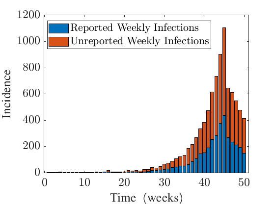

*Fig 1: Example simulation with $\rho = 0.4$*

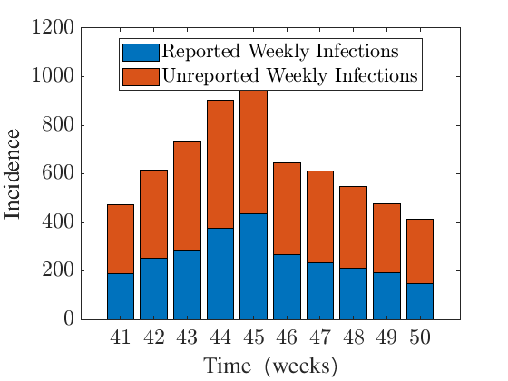

*Fig 2: Same example simulation with $\rho = 0.4$*

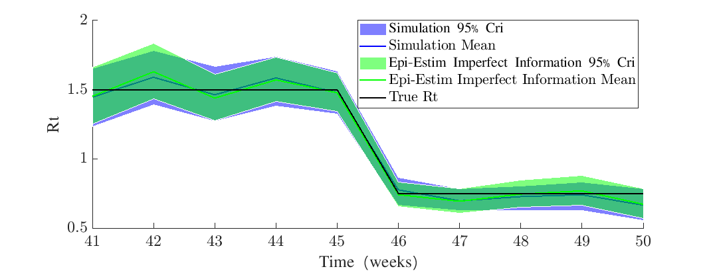

*Fig 3: Comparison of inference for simulation method vs Epi-Estim*

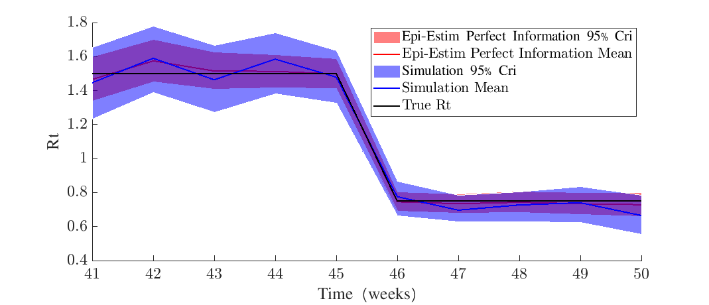

*Fig 4: Comparison of inference for simulation method vs Epi-Estim (with perfect information)*

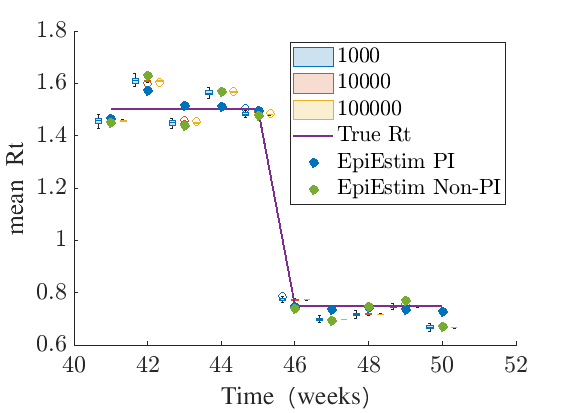

*Fig 5: Robustness check 1. Inference of same epidemic 30 different times for different values of M (and EpiEstim with perfect and imperfect information)*
Message for Fig 5: As $M$ increases, the mean estimate becomes more robust. We suggest $M = 10^5$ for the remainder of the study. Possibly reference this in main text but show analysis in appendix.

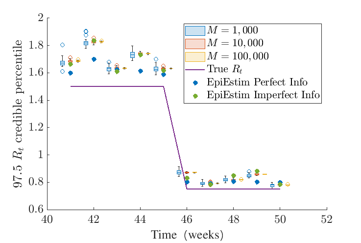

*Fig 6: Robustness check 2. Inference of same epidemic 30 different times for different values of M (and EpiEstim with perfect and imperfect information)*
Message for Fig 6: As $M$ increases, the upper percentile estimate becomes more robust. 

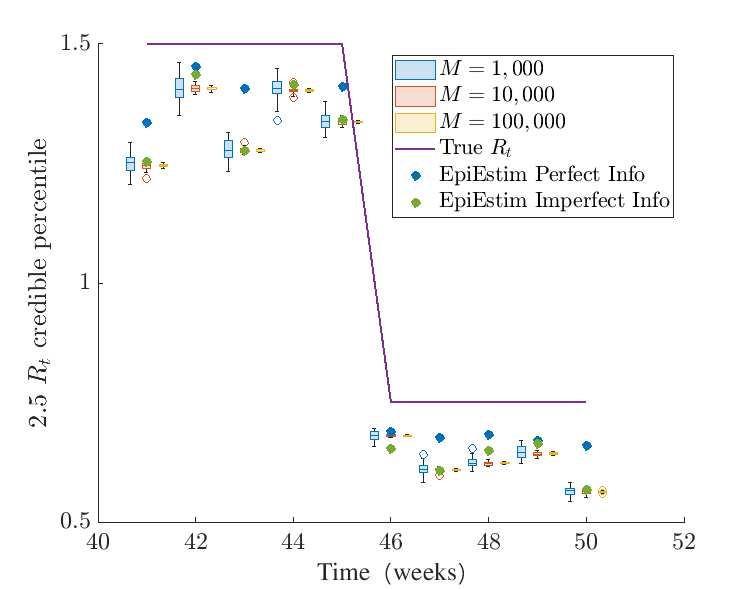

*Fig 7: Robustness check 3. Inference of same epidemic 30 different times for different values of M (and EpiEstim with perfect and imperfect information)*
Message for Fig 7: As $M$ increases, the lower percentile estimate becomes more robust. 

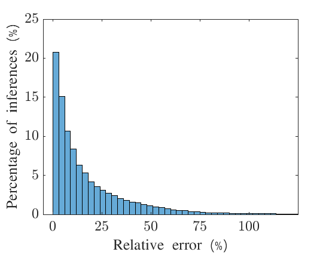

*Fig 8: Relative error distribution over 6000 simulations*
Message for Fig 8: Over a wide range of epidemics and a broad spectrum of reporting rates, we find that the relative error distribution to take the following form, with mean value 19.8%.
NB: Do we need to qualify this somehow? Is 19.8% good or not? We can also investigate whether there is systematic over-estimation/under-estimation but this will probably be an artifact of what the true $R_t$ and serial intervals are. Perhaps, we simply state what the error is and then look at the coverage to indicate that the method works.

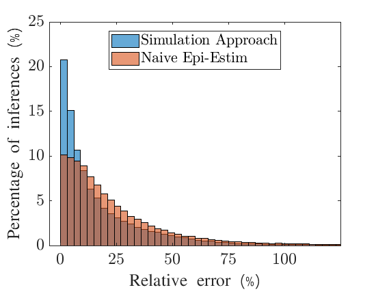

*Fig 9:  Relative error distribution over 6000 simulations vs Naive EE*
Message for Fig 9: Same message as Figure 8 but manages to qualify the result. 25.8% is the mean error for Naive approach. This could replace Fig 8 if we want to compare our estimate and substantiate our claim more clearly. We also find that in 68% of inferences points, our method was more accurate than Naive EpiEstim.
NB: This motivates our approach over a straightforward Epi-Estim approach very clearly.
NB: EpiEstim in R only computes from Week 3 onwards so we need to fix this.
NB: We could also show that EpiEstim gives incorrect coverage.

## Section 2

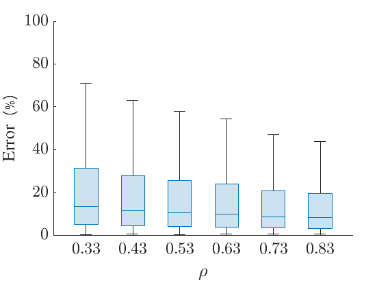

*Fig 10: Comparison of inference for simulation method when different true values of rho are modelled*
Message for Fig 10: For the plausible range of $\rho$ values (0.33-0.83), we see that the error decreases as we reporting rates get higher. This message can be used to motivate higher recording rates in epidemics. [I think this happens because coefficient of variation decreases as you increase $\rho$ (extreme example is 0 CoV in true incidence when $\rho=1$)]

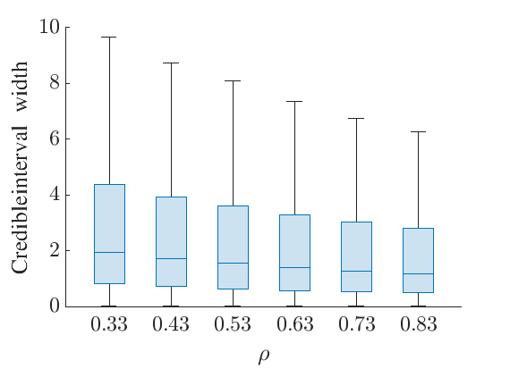

*Fig 11: Comparison of inference for simulation method when different true values of rho are modelled*
Message for Fig 11: For the plausible range of $\rho$ values (0.33-0.83), we see that the credible interval width decreases as we reporting rates get higher. This message can be used to motivate higher recording rates in epidemics. [I think this happens because coefficient of variation decreases as you increase $\rho$ (extreme example is 0 CoV in true incidence when $\rho=1$)]

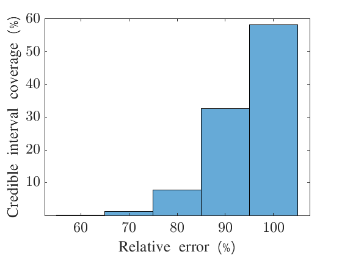

*Fig 12: Looking at coverage for over many statistics*
Message for Fig 12: Along with the statistic that 94.8% of all credible intervals correctly contained the true reproduction number, this figure demonstrates that the coverage is also fairly consistent.

The following results demonstrate that there are conflicting outcomes when we set up an experiment with fixed reported incidence, and vary $\rho$.
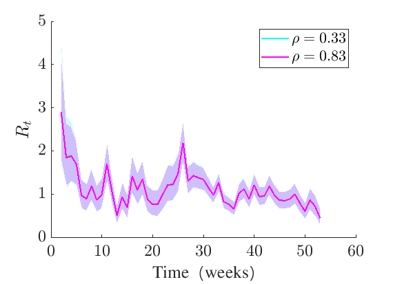

*Fig 13: Inferences for two different $\rho$ values. Smaller $\rho$ gives wider credible intervals*
Message for Fig 13:

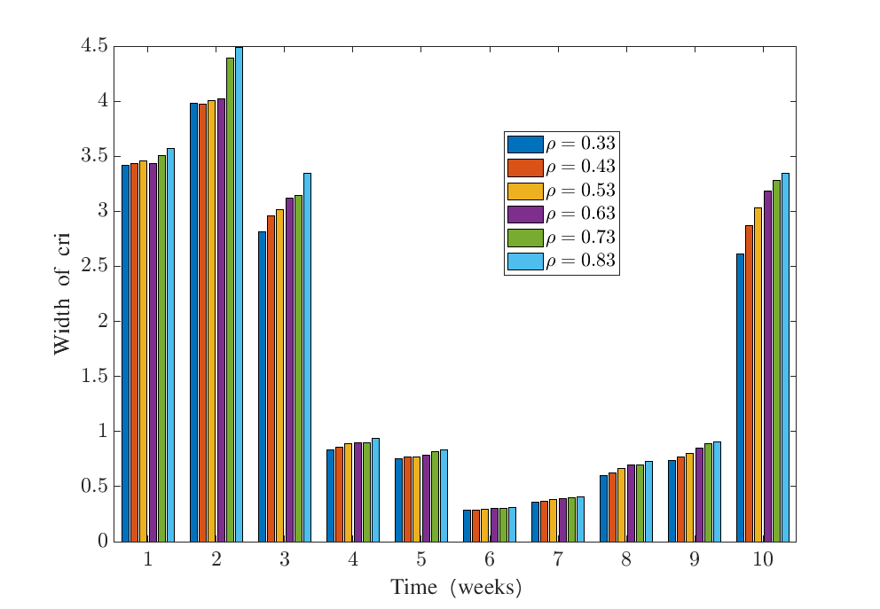

*Fig 14: Inferences for six different $\rho$ values. Smaller $\rho$ gives narrower credible intervals*
Message for Fig 14:

We need to investigate why this happens. Argument Nic/Ed give is clear. Lower $\rho$ yields higher inferred true incidence, leading to higher certainty in $R_t$ inference. This argument may break down if incidence is low.

A: If recorded incidence is low and rho is low, true incidence has a large coefficient of variation, and true incidence is variable?
B: If recorded incidence is low and rho is high, true incidence has a lower coefficient of variation, and true incidence is low.
C: If recorded incidence is high, then regardless of rho, we know incidence has a small coefficient of variation, and true incidence is high.

To get narrow credible intervals, we need both the true incidence to be high and to have a low coefficient of variation. This is satisfied in case C, and therefore only rho matters: lower rho leads to narrower credible intervals.

But between case A and B, it is not clear which will lead to wider credible intervals. A gives large CoV giving wide cri but incidence is not necessarily high or low. B gives certainty that true incidence is low but the lower CoV means that may lead to narrower cri.

Example: If recorded incidence is 0, and $\rho$ is low, then incidence can feasibly take a very wide range of values. If instead $\rho$ is high, then incidence can only feasibly take a few low values. This means, it is not straight forward as to which one will have the wider credible interval.

Experiment Suggestion: infer $R_t$ with constant reported incidence. Repeat with different values of $\rho$ and with different values of constant incidence. Plot a graph of which value of $\rho$ gives widest and narrowest credible interval. Prediction: Smaller $\rho$ gives smaller credible intervals for large incidence, but perhaps opposite (or an intermediary effect) with low incidence (i.e. medium $\rho$ give smallest credible interval).

Note: Variation argument works in opposite ways (in terms of $\rho$) depending on what you fix. If you fix true incidence in experiment, then variation for inferred true incidence decreases as $\rho$ increases (Take $\rho=1$ as extreme example)

If instead you fix the reported incidence, then coefficient of variation for inferred true incidence (usually) increases as $\rho$ increases- although there are excepts to this!