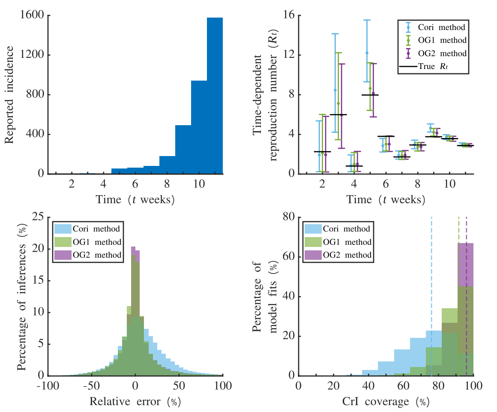
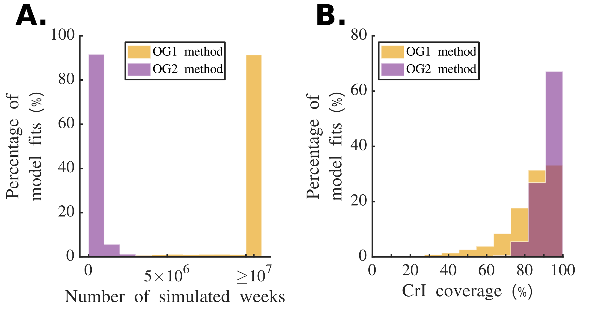
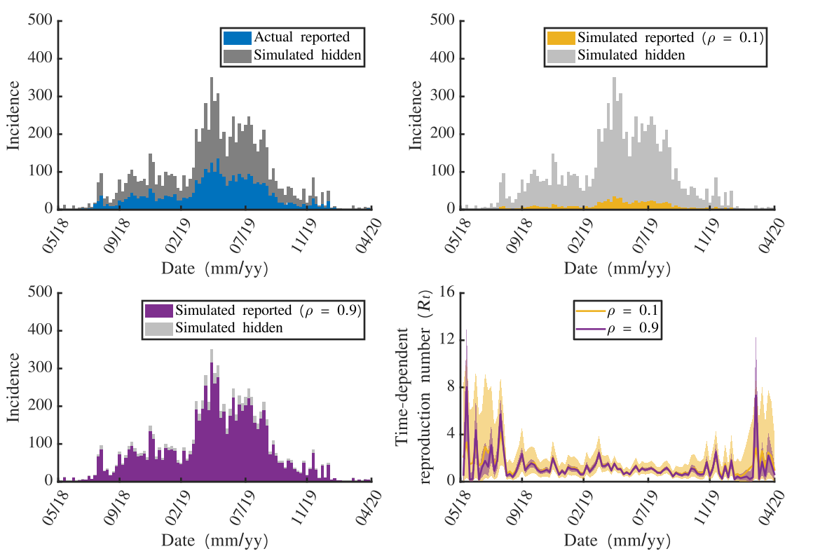

---
output:
  pdf_document: default
  html_document: default
---
# UnderreportedAndTemporallyAggregated

This README.md file contains the current work and outline for our project on inferring the instantaneous reproduction number whilst accounts for temporally aggregated and under-reported incidence data.

This repository contains code for reproducing the results presented in the proposed manuscript, "Efficient simulation-based inference of the time-dependent reproduction number from temporally aggregated and under-reported disease incidence time series data".

All code written in Julia 1.11.1, or MATLAB, compatible with version R2021b.

Code used to generate the panels comprising figure 1 can be found in "MATLAB/schematics.m".

Code for reproducing figures 2, 3, S1 and S2 can be found in "MATLAB/syntheticAnalysesCluster_noLimit.m".

Code for reproducing figure 4 can be found in "MATLAB/compareInferenceOldVsNew.m".

Code for reproducing figure 5 can be found in "MATLAB/plotRWDEbola.m".

Code for reproducing figures 6 and S3 can be found in "MATLAB/compareInferenceTemporalRho.m".

Code for the analysis to generate figures 2, 3 and S2 can be found in "julia/largeScaleStudyOriginalMethodSLURM.jl".

Code for the analysis to generate figure 4 can be found in "julia/ebolaRWDAnalysisEdittedSingleNaive.jl".

Code for the analysis to generate figure 5 can be found in "julia/ebolaRWDAnalysisEditted.jl".

Code for the analysis to generate figures 6 and S3 can be found in "julia/largeScaleStudyIncreasingSLURMRhoOG1.jl", "julia/largeScaleStudyDecreasingSLURMRhoOG1.jl", "julia/largeScaleStudyDecreasingRhoSLURM.jl" and "julia/largeScaleStudyIncreasingRhoSLURM.jl"

Code for the analysis to generate figure S1 can be found in "julia/robustnessCheckFromLargeScaleStudy.jl".

Code for implementation of the OG1 method can be found in "julia/juliaUnderRepFunctions.jl", in the function named inferTempAggOnlyR.

Code for implementation of the OG2 method can be found in "julia/juliaUnderRepFunctions.jl", in the function named inferUnderRepAndTempAggR.

Code for a referenced implementation of the OG2 method can be found in "julia/referenceImplementation.jl", in which the user can simulate their own epidemic with a true set of reproduction numbers, and use the proposed OG2 method to re-infer them.

## Terminology

$\rho$: Reporting probability
$I_t$: True incidence at time $t$
$\hat{I}_t$: Reported incidence at time $t$
$M$: Acceptance threshold in ABC algorithm

## Overview

The results of this project are broken down into 4 main sections (with main message in brackets):

# 1. Simple single study and large study (fixing true incidence) to show inference works (lower errors than Naive EE, correct coverage, robust for $M=10^5$)
# 2. Real world data set demonstrating that our novel method gives different answers to a naive usage of the last method (and therefore motivates the need for it)
# 3. Same large study  but stratified by $\rho$ (improving reporting leads to greater confidence in $R_t$ inference wrt credible intervals and mean error)
# 4. Real world data-set from an Ebola outbreak (showing that higher $\rho$ leads to narrower credible intervals but with RWD)

## Schematic

## Section 1. Checking inference is accurate, approppriately covered and robust.

We simulate a large number of epidemics, where the true $R_t$ values are sampled from the same gamma distribution that informs our prior. We look at a single outbreak and compare this to Epi-Estim, as well as looking at the whole set of epidemics vs Epi-Estim. The point is to show accuracy and coverage are better than an Epi-Estim approach that does not consider under-reporting effects. We also show that our method is robust when choosing values of $M$ that are large enough.

*Fig 2: Estimation of $R_t$ from reported disease incidence time series dataset. A.  The simulated outbreak dataset (blue bars) generated with $R_t \sim \Gamma(1,3)$ for $t = 1, 2, \ldots , 11$ (dotted black line in panel B). The true outbreak, $I_t$ was simulated with $P = 7$ (daily) with one initial case on the first day, new cases were aggregated into weekly counts, and the incidence that was reported was sampled using a Binomial distribution, $\hat{I}_t\sim Bin(I_t, \rho)$, where $\rho = 0.5$. B. Estimates of $R_t$ obtained using the Cori method without accounting for under-reporting(blue) and the novel simulation simulation-based approach with $\rho = 0.5$ (green). The 95% credible intervals are illustrated with the shaded regions, and the mean estimates are illutrstaed via the solid lines*

*Fig 3: Distributions of error and credible interval coverage for 1000 epidemics with 9 different reporting rates, $\rho = 0.1, 0.2, \ldots 0.9$. For each simulated epidemic, $R_t \sim \Gamma(1,3)$ for $t = 1, 2, \ldots , 11$ and reported incidence was sampled from the true incidence using a Binomial distribution with probability $\rho$. For each disease incidence time-series, we applied the Cori method without accounting for under-reporting, and our novel simulation-based approach that does account for under-reporting. A. Absolute relative error ($|R_t - \hat{R}_t|/R_t$) distribution for each time-point over all reported epidemics. Where inference gave credible interval widths greater than a third of the prior distribution, the data point was not included. B. Credible interval coverage (95%) over each time-series for each method. Where inference gave credible interval widths greater than a third of the prior distribution, the data point was not included. *

*Fig 4: Clear demo that our method is more robust, and motivates why we choose M=100,000 (SUPP)*

## Section 2. Inference gives wider credible intervals than naively using Original method and scaling up

Now that we have shown that our method is better than using Epi-Estim in this scenario, what about using our old method? We show that naively implementing the old method is also not sufficient.

*Fig 5: Multiply all incidence data by 2.5 (given $\rho = 0.4$) and compute inference with old method vs using new method.*

In the following section, we motivate getting better reporting rates by showing that $R_t$ inference gives a wide range of values depending on what $\rho$ is assumed. It is therefore critical that an accurate value of $\rho$ is obtained. It also beneficial to increase reporting as this is correlated with better accuracy and coverage.

## Section 3. Increasing $\rho$ leads to more accurate inference with appropriate coverage

