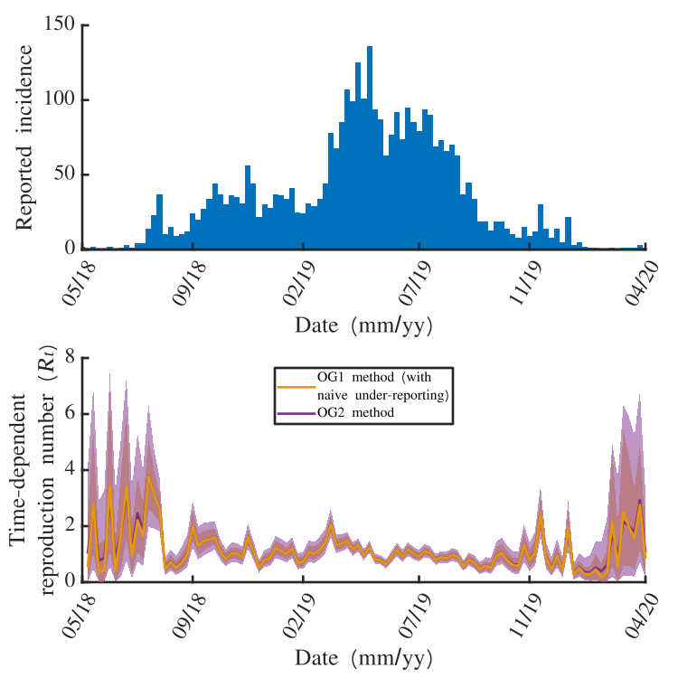
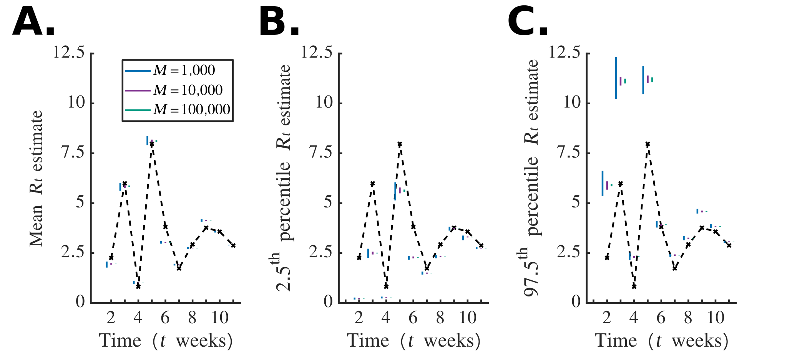

---
output:
  pdf_document: default
  html_document: default
---
# UnderreportedAndTemporallyAggregated

This README.md file contains the current work and outline for our project on inferring the instantaneous reproduction number whilst accounts for temporally aggregated and under-reported incidence data.

## Terminology

$\rho$: Under-reporting
$I_t$: True incidence at time $t$
$\hat{I}_t$: Reported incidence at time $t$
$M$: Acceptance threshold in ABC algorithm

## Overview

The results of this project are broken down into 4 main sections (with main message in brackets):

# 1. Simple single study and large study (fixing true incidence) to show inference works (lower errors than Naive EE, correct coverage, robust for $M=10^5$)
# 2. Real world data set demonstrating that our novel method gives different answers to a naive usage of the last method (and therefore motivates the need for it)
# 3. Same large study  but stratified by $\rho$ (improving reporting leads to greater confidence in $R_t$ inference wrt credible intervals and mean error)
# 4. Real world data-set from an Ebola outbreak (showing that higher $\rho$ leads to narrower credible intervals but with RWD)

## Still to do (analysis):

+ Running old method on the 9,000 different data-sets. (currently running but may take a while!)

+ Start skeleton for manuscript. Results are outlined here. Methods skeleton at bottom of page.

## Schematic

## Section 1. Checking inference is accurate, approppriately covered and robust.

We simulate a large number of epidemics, where the true $R_t$ values are sampled from the same gamma distribution that informs our prior. We look at a single outbreak and compare this to Epi-Estim, as well as looking at the whole set of epidemics vs Epi-Estim. The point is to show accuracy and coverage are better than an Epi-Estim approach that does not consider under-reporting effects. We also show that our method is robust when choosing values of $M$ that are large enough.

*Fig 2: Estimation of $R_t$ from reported disease incidence time series dataset. A.  The simulated outbreak dataset (blue bars) generated with $R_t \sim \Gamma(1,3)$ for $t = 1, 2, \ldots , 11$ (dotted black line in panel B). The true outbreak, $I_t$ was simulated with $P = 7$ (daily) with one initial case on the first day, new cases were aggregated into weekly counts, and the incidence that was reported was sampled using a Binomial distribution, $\hat{I}_t\sim Bin(I_t, \rho)$, where $\rho = 0.5$. B. Estimates of $R_t$ obtained using the Cori method without accounting for under-reporting(blue) and the novel simulation simulation-based approach with $\rho = 0.5$ (green). The 95% credible intervals are illustrated with the shaded regions, and the mean estimates are illutrstaed via the solid lines*

*Fig 3: Distributions of error and credible interval coverage for 1000 epidemics with 9 different reporting rates, $\rho = 0.1, 0.2, \ldots 0.9$. For each simulated epidemic, $R_t \sim \Gamma(1,3)$ for $t = 1, 2, \ldots , 11$ and reported incidence was sampled from the true incidence using a Binomial distribution with probability $\rho$. For each disease incidence time-series, we applied the Cori method without accounting for under-reporting, and our novel simulation-based approach that does account for under-reporting. A. Absolute relative error ($|R_t - \hat{R}_t|/R_t$) distribution for each time-point over all reported epidemics. Where inference gave credible interval widths greater than a third of the prior distribution, the data point was not included. B. Credible interval coverage (95%) over each time-series for each method. Where inference gave credible interval widths greater than a third of the prior distribution, the data point was not included. *

*Fig 4: Clear demo that our method is more robust, and motivates why we choose M=100,000 (SUPP)*

## Section 2. Inference gives wider credible intervals than naively using Original method and scaling up

Now that we have shown that our method is better than using Epi-Estim in this scenario, what about using our old method? We show that naively implementing the old method is also not sufficient.

*Fig 5: Multiply all incidence data by 2.5 (given $\rho = 0.4$) and compute inference with old method vs using new method.*

In the following section, we motivate getting better reporting rates by showing that $R_t$ inference gives a wide range of values depending on what $\rho$ is assumed. It is therefore critical that an accurate value of $\rho$ is obtained. It also beneficial to increase reporting as this is correlated with better accuracy and coverage.

## Section 3. Increasing $\rho$ leads to more accurate inference with appropriate coverage

# Important points to discuss

- schematic
- removed inference points: in Fig 5, none of the inference points have credible interval widths less than 50% of the prior width. This means we may need to zoom in on fig?
- code currently running on original method
- extra figure on speed once original method analysis is complete

# Subtle points not to forget

We could do a more elaborate version of scaling up the old method, but this would not be computationally feasible in reality.

Means can also differ in the RWD experiments and we could quote the values where they differ.

In large-scale study, we remove inference points that give credible intervals that are too wide. In practice this is all credible intervals that a
+
-

.
re greater than 50% of the width of the prior. Should we also do this in the RWD?

## Skeleton of Manuscript

# Introduction

# Methods

Notes: We will make it clear to the reader that we consdier a version of Epi-Estim that makes no attempt to account for under-reporting or temporal aggregation.

Initial paragraph: 
Outline that we compare 3 methods: Cori et al, Ogi-Gittins et al, and our new method on simulated and RWD. Briefly describe that:
 - Epi-Estim accounts for neither aggregation or under-reporting, 
 - Ogi-Gittins accounts for aggregation and 
 - New method accounts or both, so expect accuracy to increase through these methods.
 -Throughout, we use the same Ebola serial interval distribution (mean = 15.3 days, std = 9.3)

**SS1**

P1: 
EpiEstim: outline renewal equation using conjugate priors. 
- Similar to section 2.1 in Ogi-Gittins et al. but instead state the posterior result given prior and likelihood assumptions.
- Replace $I$ with $\hat{I}$ throughout since $I$ is reserved for true incidence. Remove discussion of $\tau$.

P2: Explain why not accounting for under-reporting or aggregation may lead to inaccurate $R_t$ inference.
- Cori et al. relies on assumption that incidence in week $t$ is dependent on incidence in weeks prior to week $t$ and not on $t$ itself (due to no temporal dis-aggregation). 
- Add main point that the under-reporting implies more uncertainty from incidence propagating into $R_t$ inference.
- Taking both together implies large range of dis-aggregated incidences that are not accounted for.

**SS2**

P1: Description of Bayesian approach to reverse binomial distribution. Taking a non-informative prior belief about $n$ ($P(n)$), we find $$\mathbb{P}(n;x, p) \propto {n\choose x}p^x(1-p)^{(n-x)}$$ $\forall$ $n$. Using fact that sum of all possible values of $n$ (from $x$ to $\infty$) will sum to 1, we arrive at $$ \mathbb{P}(n;x,p) = \frac{{n\choose x}(1-p)^{(n-x)}}{\sum_{i=x}^{\infty}{i\choose x}(1-p)^{(i-x)}}$$

P2: Outline differences between this new method and Ogi-Gittins et al., suggesting the reader reads that paper first?
 a) initialisation: OG samples from uniform distribution of $\hat{I}_1$ into $\hat{I}_1^{(P)}$, $\hat{I}_2^{(P)}, \ldots$ whereas new method uses "reverse-binomial" to sample true weekly incidence, $I_1$ and then use the sampling approach from Ogi-Gittins et. al. to sample $I_1^{(P)}$, $I_2^{(P)}$, etc. 
 b) Sampling previous aggregated incidence is now proportional to likelihood of previous time-step (in original, likelihoods are all equal).
 c) Renewal equation approach is identical (sample from Gamma prior independently at each time-step) but note that we are now using $I$ as opposed to $\hat{I}$. 
 d) ABC now accepts any simulation where the summation exceeds the reported $\hat{I}_t$. 
 e) We now weight contributions into posterior according to their binomial likelihood. 
 f) Repeat until final time-step (same in both). Add on the end that a more suitable choice of $M$ is 100,000 for new approach, as opposed to 1,000 for Ogi-Gittins et al. Summarise this in a schematic.

P4: Re-iterate how original method can be improved by our new approach, i.e. solves the under-reporting issue.

**SS3**: Outbreak data-sets. 

Initial paragraph: We look at A) Simulated data, B) Real-world data C) Real-world data that is manipulated. 

P1: 
- Test on large number of epidemics via simulated data, and compare to Epi-Estim and Ogi-Gittins et al. 
- Data generated by sampling the true $R_t$ from a Gamma($R_t$, shape = 1, scale = 2) distribution, which is also our prior for $R_t$.
- Only accept incidences where the max incidence does not exceed 500.
-Seek to compare single inference, large-scale differences in accuracy/coverage and the effect of $\rho$.

P2: 
- Compare new method to Ogi-Gittins et al. (with simple scaling) on RWD [Ebola 2018-2020 outbreak aggregated into weeks] to see if the scaling is a worthy approach.
- Explain that a method where we consider sample possible true incidences from reported incidence but then use the Original method would be very computationally expensive.

P3: 
- We look at inferring $R_t$ on manipulated RWD for different values of $\rho$. The RWD is maniuplated by taking reported incidence and then simulating a possible true incidence, and then taking a proportion of this as another possible reported incidence for two different values of $\rho$. We then compare inferences.

# Results

**SS1: Simulated Data-set**

P1: 
- Statement of simulation method and why we expect ours to be better than Epi-Estim and Ogi-Gittins et al. in accuracy and coverage. 
- We do not choose a serial interval that is particularly short and so we expect the discrepancy to mainly be due to under-reporting effects. 
- We use a variety of true $\rho$ values (0.1-0.9) so that our conclusions can also be dependent on $\rho$.
- Because reported incidence is kept reasonably low in these simulations, guarantee that the uncertainty in the true incidence is large and so has big effect on credible intervals.

P2: 
- Make specific references to large-scale data set, in particular average accuracy scores and average coverage scores for each method. 
- Also look at whether this is syematic over/under-estimation. Show that this demonstrates that New method > Ogi-Gittins > EpiEstim.

P3: Further to main analysis, we look at the effect of different values of $\rho$, particularly its effect on accuracy (quote 75th percentiles and how they decrease as $\rho$ increases).

**RWD: Ebola 2018-2020 outbreak**

P1:
incidence for each day in various regions of DRC (does RT have specific details?). We then aggregate these into weekly counts. We analyse the RWD in two different ways. 

P2: A) taking weekly RWD and after assuming a value of $\rho=0.4$ compute $R_t$ using our novel method versus scaled-up approach of original method. Specific analysis of patterns that are seen in results can be commented on here. 

P3: B) taking weekly RWD and simulating a possible time-series of the true incidence, and then simulating two possible reported incidence time-series (for different values of $\rho$). Then with knowledge of these $\rho$ values, infer $R_t$. Again, patterns of difference in inference can be commented on.

# Conclusions

Need to correctly specify $\rho$. Increased $\rho$ in data-collection leads to X, Y, Z. See Dalziel.

Speed is much improved with this extension due to ABC no longer needing exact condition.

Adding in point of beta-binomial likelihood as a possible solution to what to do when $\rho$ is uncertain.
