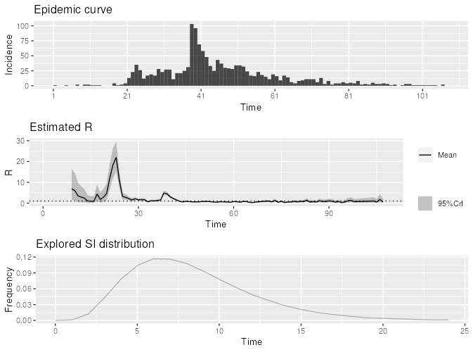
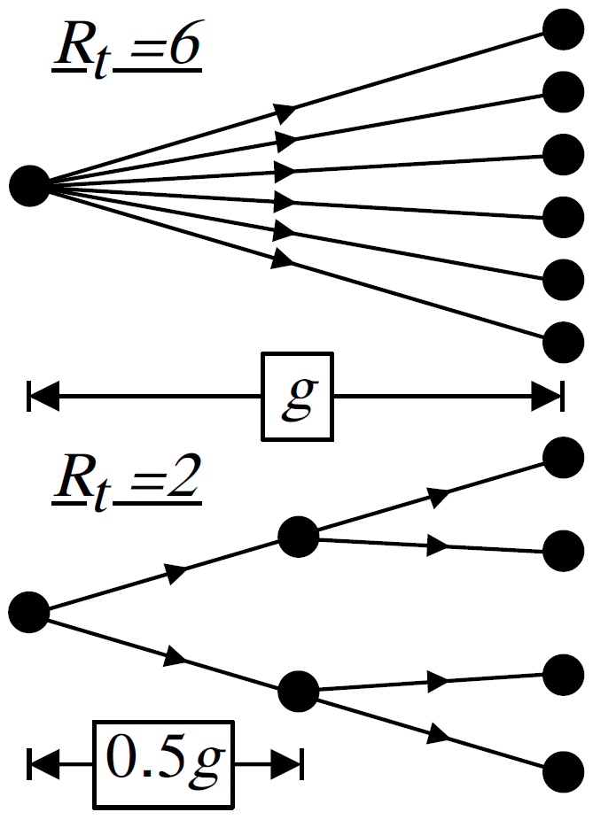
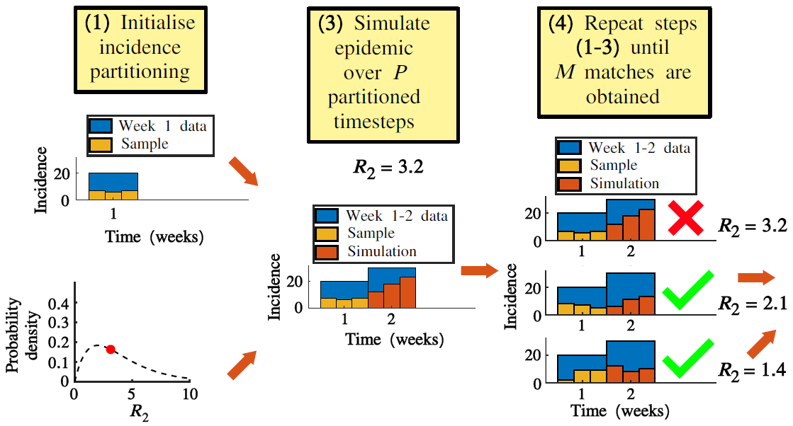
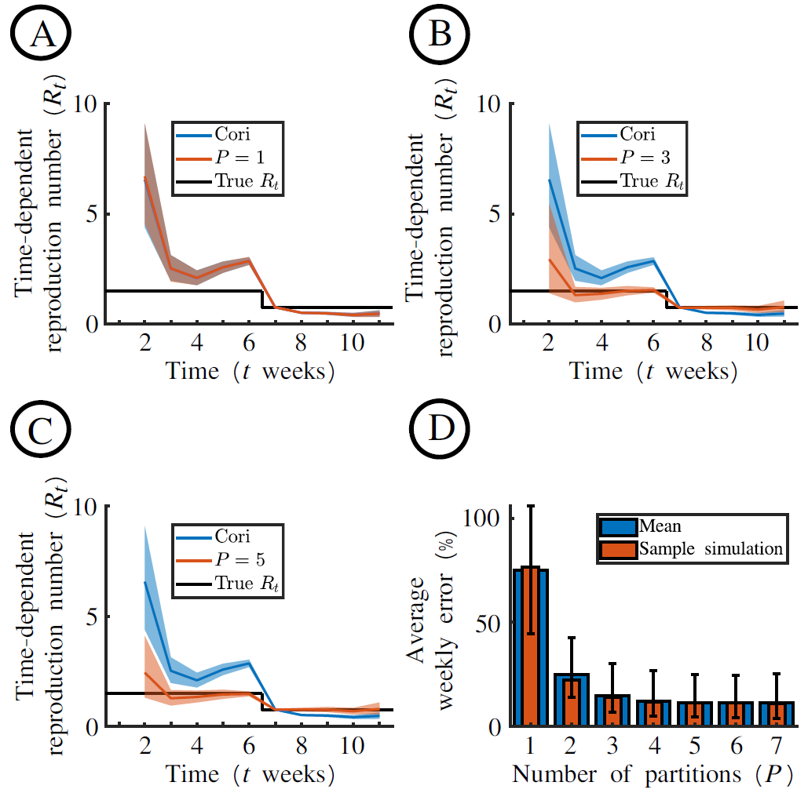
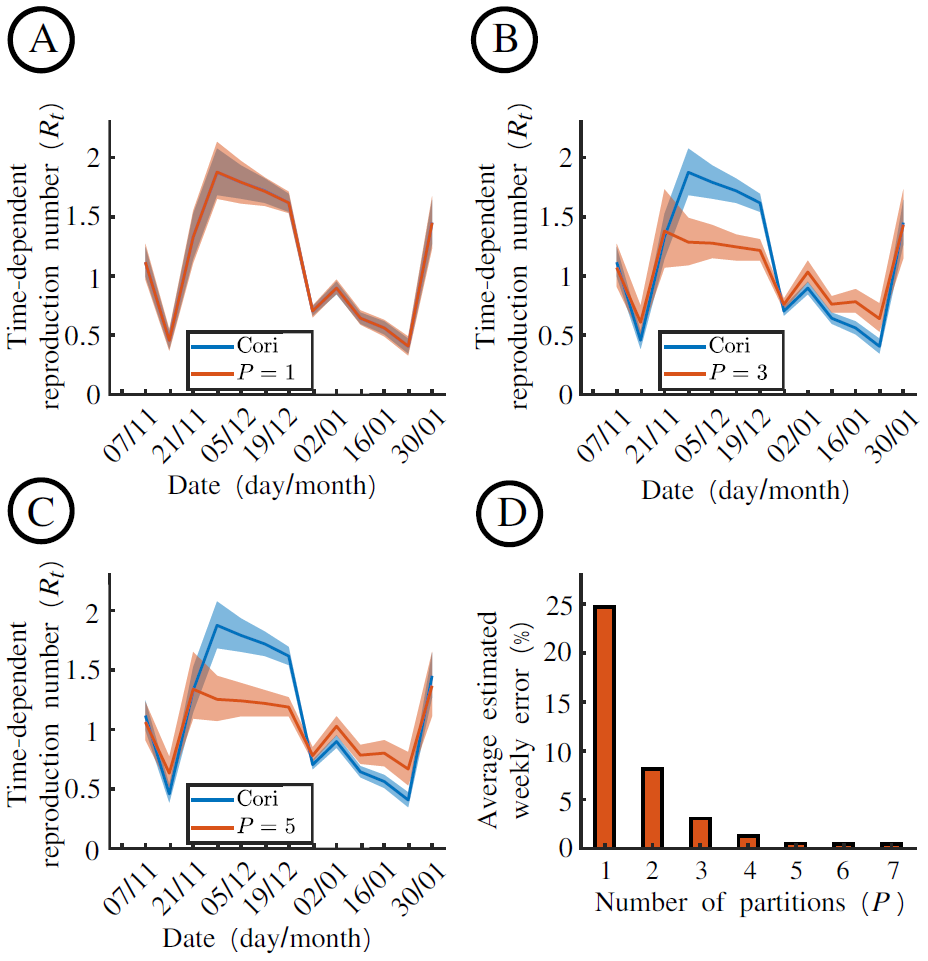
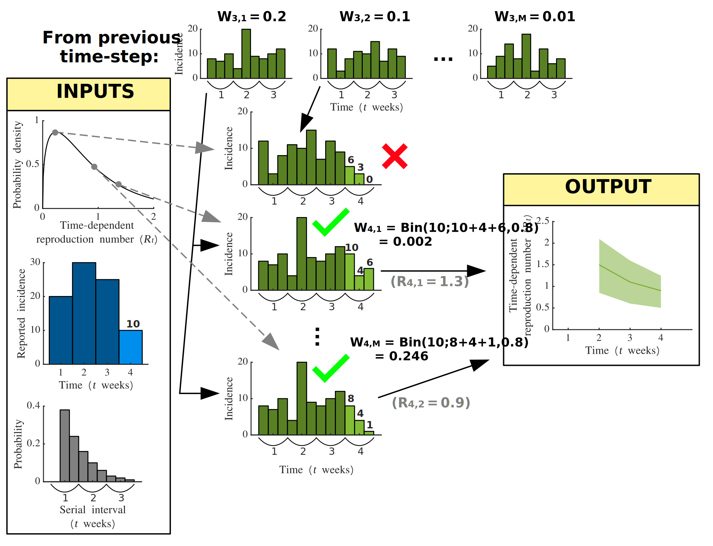
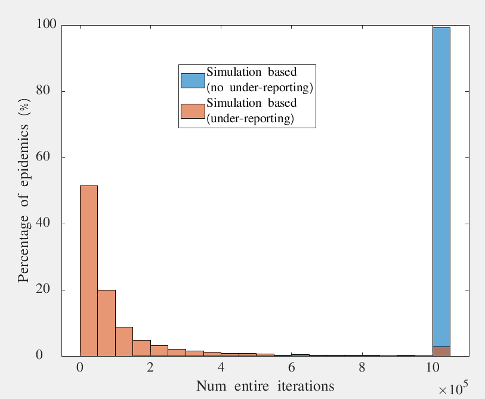
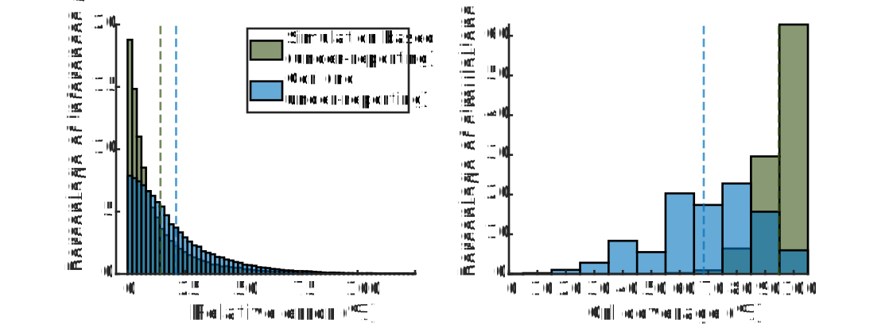
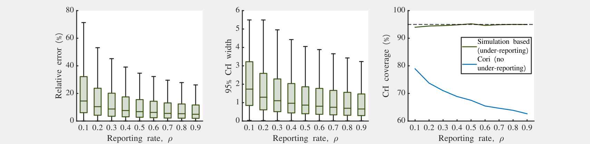

```{r setup, include=FALSE}
knitr::opts_chunk$set(echo = FALSE)
```

# Reproduction is great!

<p align="center">
    
</p>

# Why bother with $R_t$?

## Interpretable

$>1$ or $<1$

## Real-time

## Monitor impact of interventions

Suitable retrospectively

# Terminology and Notation

## What we know

- $\boldsymbol{w}$: The discrete generation time distribution, $I_t$: The reported incidence at time $t$

## What we wish we knew

- $X_{t, t-i}$: The number of cases on day $t$ arising due to cases on day $t-i$

## Why?

$$R_t = \frac{\sum_{i=1}X_{t+i,t}}{I_t}$$

## Why don't we know this?

- Transmission trees are hidden
- We can't see into the future!

# Time-dependent reproduction numbers

|Property | $R_t$ (Instantaneous) | $R_t^c$ (Case) |
|----------|:----------:|:----------:|
|Definition| Average number of people someone infected at time $t$ **could expect to infect *should conditions remain unchanged* ** |Average number of people someone infected at time $t$ **can expect to infect**|
|Mean estimate| $\frac{I_t}{\sum_{s=1}I_{t-s}w_s}$   |$\frac{\sum_{s=1} I_{t+s}w_s}{\sum_kI_{t+s-k}w_k}$   |
|Popular Method|Epi-Estim|Wallinga-Teunis|
|Pros|Real-time estimate, Prior information incorporated, Analytical|No inherent condition|
|Cons|Assumes condition remains the same|Simulation-based, Retrospective only, No prior|

# Utility of Reproduction Numbers

- Population Dynamics (birth-counts & maternal age distribution)
- Information Dissemination[^1] (new "believers" & "conversion" distribution)

<p align="right">
    
</p>

[^1]: https://churchmodel.org.uk/home/about/

# Epi-Estim [^2]

If $R_t \sim \Gamma(a, b)$ and $I_t|I_1^{t-1}, R_t \sim \mathrm{Poi}(R_t\sum_{s=1}I_{t-s}w_s)$, then $$R_t| I_1^t, \boldsymbol{w}\sim \Gamma\left(a+I_t-1, \frac{1}{\sum_{s=1}I_{t-s}w_s+1/b}\right)$$

<p align="center">
    
</p>

[^2]: Cori A, Ferguson NM, Fraser C, Cauchemez S. A new framework and software to estimate time-varying reproduction numbers during epidemics. Am J Epidemiol. 2013

# Problems outlined in the literature [^3]

1. Generation interval misspecification
2. Adjusting for delays
3. Adjusting for right truncation
4. Accounting for incomplete observation
5. Smoothing windows

[^3]: Gostic KM, McGough L, Baskerville EB, Abbott S, Joshi K, et al. Practical considerations for measuring the effective reproductive number, Rt. PLOS Computational Biology. 2021

# Accounting for incomplete observation

## Temporally aggregated incidence
  + weekly aggregations e.g. Ebola, COVID
  + particularly relevant for short GI (see next slide)
  
## Incidence under-reporting
  + always occurs without mass-testing
  + requires knowledge of reporting probability, $\rho$

# Accounting for incomplete observation (ctd.)

<p align="center">
    
</p>

# Method accounting for temporally aggregated incidence: Exact ABC [^4]

<p align="center">
    
</p>

[^4]: *Ogi-Gittins et al. A simulation-based approach for estimating the time-dependent reproduction number from temporally aggregated disease incidence time series data,  2024

# Results 1

<p align="center">
    
</p>

# Results 2

<p align="center">
    
</p>

# Method accounting for temporally aggregated incidence and under-reporting: Weighting with Binomial likelihoods

<p align="center">
    
</p>

# Results

<p align="center">
    
</p>


# Results

<p align="center">
    
</p>

# Results

<p align="center">
    
</p>

# Conclusions

- $R_t$ inference not accounting for temporally aggregated incidence can lead to large errors in $R_t$ inference
- $R_t$ inference accounting for temporally aggregated incidence but not under-reporting can lead to incorrect coverage
- We can solve both problems with these simulation-based approaches, and the latter approach can improve speed!

# Thank you!

Questions?


